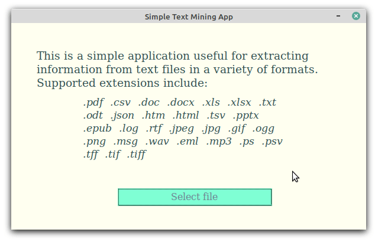

# Named Entity Extractor

Predict the [named entities][n_ents] present in a file using [spaCy][spacy]. *spaCy* is a powerful, user-friendly, open-source [Natural Language Processing][nlp] library in Python.

Text to be processed is extracted from documents using [textract][textract]. The results (*named entities* and some *context*) are then saved in an excel file.



## Getting Started

1. Download the files, and set up a virtual environment:

    ```bash
    git clone https://github.com/Tim-Abwao/named-entity-extractor.git
    cd named-entity-extractor
    python3 -m venv venv
    source venv/bin/activate
    ```

2. Install the required packages:

    ``` bash
    pip install -U pip
    pip install openpyxl pandas spacy textract
    python -m spacy download en_core_web_md
    ```

3. Start the app:

    ```python
    python -m entity_extractor
    ```

A [tkinter][tkinter] [GUI][gui_wiki] (demonstrated above) should pop up to help navigate to, and select a document to process.

>**NOTE:** For help with `tkinter` - related issues, please see [TkDocs][tkdocs].

[spacy]: https://spacy.io/
[textract]: https://textract.readthedocs.io/en/stable/index.html
[tkinter]: https://docs.python.org/3/library/tkinter.html#module-tkinter
[gui_wiki]: https://en.wikipedia.org/wiki/Graphical_user_interface
[n_ents]: https://en.wikipedia.org/wiki/Named_entity
[nlp]: https://en.wikipedia.org/wiki/Natural_language_processing
[tkdocs]: https://tkdocs.com/index.html
