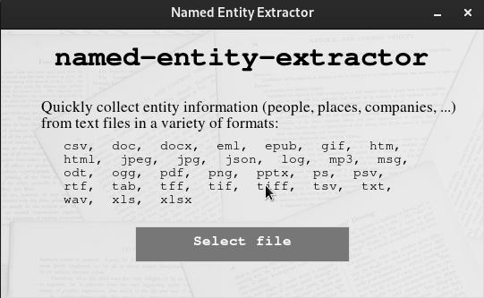

# Basic text mining using spaCy NLP

This simple app uses [spaCy][1] to extract [Named Entities][6] from text. [spaCy][1] is a powerful, user-friendly, open-source Natural Language Processing package for Python, made by [Explosion][2].

Text to be processed will be extracted from documents using [textract][3].



## Getting Started

1. Download the files, and set up a virtual environment:

    ```bash
    git clone https://github.com/Tim-Abwao/text-mining-spacy.git
    cd text-mining-spacy
    python3 -m venv venv
    source venv/bin/activate
    ```

2. Install the required packages:

    ``` bash
    pip install -U pip
    pip install -r requirements.txt
    python -m spacy download en_core_web_sm
    ```

3. Run the `text_mining.py` script to start the app:

    ```python
    python text_mining.py
    ```

A [tkinter][4] [GUI][5] (demonstrated above) should pop up to help you navigate to, and select a document to process. The app is programmed to extract [named entities][6], with some context, and export them as an Excel file.

[1]: https://spacy.io/
[2]: https://explosion.ai/
[3]: https://textract.readthedocs.io/en/stable/index.html
[4]: https://docs.python.org/3/library/tkinter.html#module-tkinter
[5]: https://en.wikipedia.org/wiki/Graphical_user_interface
[6]: https://en.wikipedia.org/wiki/Named_entity
